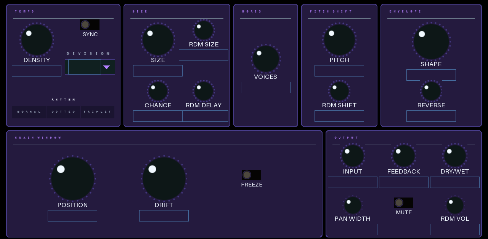

# Boris Granular (MPC VST effect)

Real-time granular insert effect for MPC OS / Force: incoming audio goes into a 10 s buffer and up to 24 overlapping
grains replay it with per-grain random size, delay, pitch, direction, volume and pan. DSP from
[boris-move](https://github.com/filliformes/boris-move) (plain C), itself a port of
[Boris Granular Station](https://github.com/glesdora/boris-granular-station) by Alessandro Gaiba. The skin follows Boris
Granular Station's own GUI: black plate, deep-purple panels, aliceblue ink, lavender accent, TEMPO / SIZE / PITCH SHIFT /
ENVELOPE across the top.

## Controls
One page, two Q-Link sets: **GRAIN** (density, size, position, pitch, feedback, pan width, freeze, dry/wet, envelope,
drift, rdm size/delay/shift, reverse, rdm vol, chance) and **TEMPO** (sync, division, rhythm, input, mute, voices).
Sync locks grain triggers to MPC's tempo (division 1/16 to 4/1, normal / dotted / triplet).

## Build
`./build.sh` (Docker) with a checkout of [mpc-vst-plugins](https://github.com/sd88me/mpc-vst-plugins) next to this repo (or `MPC_VST=<path>`). Offline test: `$MPC_VST/tools/test_port.sh vst/vst.json`.

## License
GPL-3.0 (`LICENSE`), as the upstream projects. See `src/VENDORED.md`.

## Presets
22 factory presets in `vst/presets.json`, listed in MPC's PRESET menu (the wrapper's VST programs; each sets every
parameter): Init, Realtime Grains (Boris Granular Station's own default), Soft Smear, Cloud Pad, Frozen Choir, Reverse
Swell, Half Reverse, Octave Up Shimmer, Octave Down, Fifth Harmony, Detune Wash, Glitch Scatter, Micro Grains,
Tape Stutter 1/16, Dotted Echo 1/8, Triplet Chop, Half Bar Drone (the synced ones follow MPC's tempo), Sparse Rain,
Feedback Bloom, Deep Space, Lo-Fi Thin, Wet Only Texture. Append new ones; keep the order of shipped ones.
