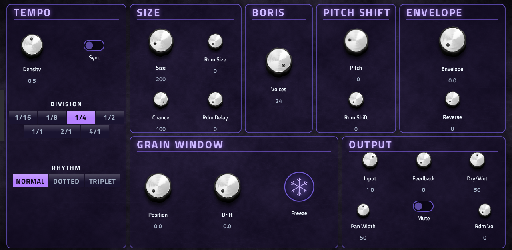

# Boris Granular (MPC / Force VST effect)

A real-time granular insert effect for Akai MPC OS and Force standalone devices. Audio going into the effect is written
to a 10 second buffer, and up to 24 overlapping grains replay it, each with its own random size, delay, pitch,
direction, volume and pan. Use it for smeared pads, frozen textures, stutters, shimmer, tape-style echoes and
tempo-synced chops.



## Features
- Granular engine with up to **24 voices** over a **10 s** circular buffer, 44.1 kHz stereo.
- **Tempo sync** to MPC's own tempo: grain triggers lock to 1/16 up to 4/1, normal, dotted or triplet.
- **Freeze** holds the buffer so the grains keep playing the captured sound.
- Per-grain randomisation of size, delay, pitch shift, volume and reverse.
- **Feedback**, **dry/wet**, input gain, pan width and mute.
- Grain envelope morphing between Hann, triangle and trapezoid.
- **22 factory presets** in MPC's PRESET menu, and full project save and recall.
- A native MPC screen skin with two Q-Link sets, and MIDI CC / NRPN control of every parameter.

## Controls
The page is laid out in panels:

| Panel | Controls |
|---|---|
| TEMPO | Density, Sync, Division (1/16 to 4/1), Rhythm (normal / dotted / triplet) |
| SIZE | Size, Rdm Size, Chance, Rdm Delay |
| BORIS | Voices (1 to 24) |
| PITCH SHIFT | Pitch, Rdm Shift |
| ENVELOPE | Shape, Reverse (probability of a reversed grain) |
| GRAIN WINDOW | Position, Drift, Freeze |
| OUTPUT | Input, Feedback, Dry/Wet, Pan Width, Mute, Rdm Vol |

**Q-Links** are in two sets. **GRAIN** holds density, size, position, pitch, feedback, pan width, freeze, dry/wet,
envelope, drift, the random amounts, reverse, random volume and chance. **TEMPO** holds sync, division, rhythm,
input, mute and voices. With **Sync** on, grain triggers follow MPC's tempo at the chosen Division and Rhythm.

## Presets
Init, Realtime Grains (Boris Granular Station's own default), Soft Smear, Cloud Pad, Frozen Choir, Reverse Swell,
Half Reverse, Octave Up Shimmer, Octave Down, Fifth Harmony, Detune Wash, Glitch Scatter, Micro Grains,
Tape Stutter 1/16, Dotted Echo 1/8, Triplet Chop, Half Bar Drone, Sparse Rain, Feedback Bloom, Deep Space,
Lo-Fi Thin, Wet Only Texture. The tempo-synced ones follow MPC's tempo. Pick one from the PRESET menu; each sets every
parameter. New presets are appended to `vst/presets.json`; the order of shipped ones is kept.

## Install
Download the release zip, copy it to the device and run the installer as root:

```
unzip Boris-Granular-<version>-mpc-armv7.zip
cd Boris-Granular-<version>
sh install.sh
```

The installer copies the plugin folder to `/sdcard/Synths`, backs up `MPC.settings`, adds the plugin to the list and
restarts MPC. Then add **Boris Granular** as an insert effect on a track (or return). `uninstall.sh` removes it.
The plugin folder (`portable/sd88me - VST - Boris Granular`) can also be dropped into a `Synths` folder by hand.
A new skin needs an MPC restart; after that, removing and re-inserting the plugin picks up an updated `.so`.

Tested on a Force (MPC OS armv7). The skin needs **MPC OS 3.x** (not 2.x).

## Build
Needs Docker and a checkout of [mpc-vst-plugins](https://github.com/sd88me/mpc-vst-plugins) (`main`) next to this repo,
or `MPC_VST=<path>`:

```
./build.sh                                 # .so, skin, plugin-list entry in vst/build/
$MPC_VST/tools/test_port.sh vst/vst.json   # offline host test (x86, ASan/UBSan)
$MPC_VST/tools/bench.sh vst/build/boris_granular.so <device-ip>
```

The skin is drawn from `vst/layout.conf`, `vst/skin.css` and the images in `vst/images/` (`gen_bg.py` and
`gen_freeze.py` regenerate the plate texture and the Freeze button).

## Credits
- **Boris Granular Station** by Alessandro Gaiba ([glesdora/boris-granular-station](https://github.com/glesdora/boris-granular-station), GPL-3.0): the original JUCE / RNBO granular effect, its design and its colours.
- **boris-move** by [filliformes](https://github.com/filliformes/boris-move) (GPL-3.0): the plain-C DSP this port is built on (vendored in `src/dsp/`, see `src/VENDORED.md`).
- **[mpc-vst-plugins](https://github.com/sd88me/mpc-vst-plugins)**: the VST2 wrapper, skin generator, test and bench tools for MPC OS.
- Skin text is set in Titillium Web (SIL OFL).

## License
GPL-3.0 (`LICENSE`), as the upstream projects.
